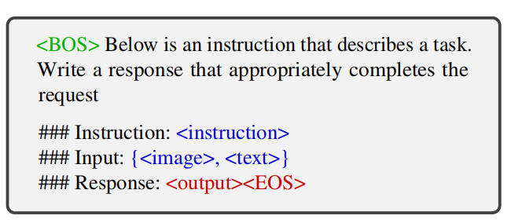
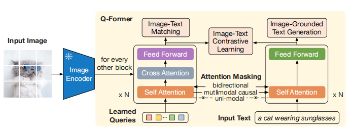

# Multimodal-LLM

**LLM-based model with the ability to receive and reason with multimodal information**

### 应用任务
    * object detection: 在一个图片分类训练集上构造text模板充分训练后，模型有一定迁移到unseen物体上的能力
    * VQA: instruction varies from pair to pair
    * image captioning
    * image-text retrieve
    * description / classification
    * segmentation
    * visual generation and editing

### 训练路线
    * M-IT: 使用多模态数据pairs对pretrainded models进行alignment pre-training, 也就是，freeze pretrained LLM&visual-encoder，然后训练一个learnable interface.

### 训练数据
    * an example of training data for MLLM: 
</a>

    * instruct data construction:
        - 从各种benchmark的数据对中衍生构造
        - self-instruct
        - 混合uni-modal指令数据训练

### Learnable Interface (模态对齐融合)
    * Q-former: 用小批量pairs数据训练小参数量的re-encoder (BERT), 通常任务包括max(similarity of positive pairs) & min(similarity of negative pairs)， 判断pairs是pos/neg，text生成(以img-emb和prefix text为condition)等
</a>
