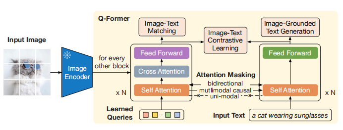

# Multimodal-LLM
**LLM-based model with the ability to receive and reason with multimodal information**

## 应用任务
1. object detection: 在一个图片分类训练集上构造text模板充分训练后，模型有一定迁移到unseen物体上的能力
2. VQA: instruction varies from pair to pair
3. image captioning
4. image-text retrieve
5. description / classification
6. segmentation
7. visual generation and editing
8. Visual Grounding: aims to locate the most relevant object or region in an image, based on a natural language query.

## Training
### Training Paradiagm
1. M-IT: 使用多模态数据pairs对pretrainded models进行alignment pre-training, 也就是，freeze pretrained LLM&visual-encoder，然后训练一个learnable interface.
### 训练数据
an example of training data for MLLM: 
</a>

* Instruct data construction:
    - 从各种benchmark的数据对中衍生构造
    - self-instruct
    - 混合uni-modal指令数据训练
### Learnable Interface (模态对齐融合)
1. Q-former: 用小批量pairs数据训练小参数量的re-encoder (BERT), 通常任务包括max(similarity of positive pairs) & min(similarity of negative pairs)， 判断pairs是pos/neg，text生成(以img-emb和prefix text为condition)等
</a>  
    
2. Learnable projection layer for visual input: 将visual feature input投影到LLM空间，和instruct(text)输入concat，concat顺序为随机采样(暂未讨论先后顺序对生成结果的影响)
</a>  

3. MiniGPT-4: a single projection layer? 跟上面一样？  

4. ML-MFSL [38] is similar to Flamingo, where a visual prefix is introduced as a learnable feature to extract
information related to text from the image.